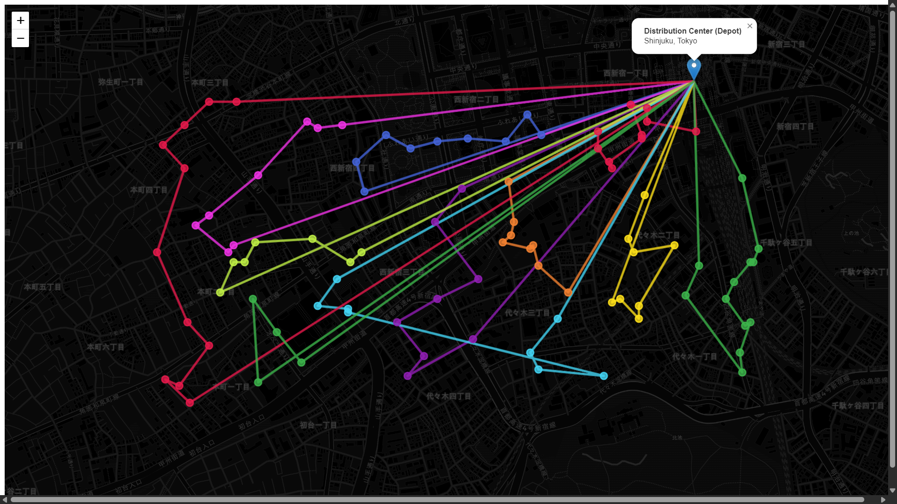

# 🚚 Urban Logistics Optimizer (Tokyo)

**Live Demo:** [View the Interactive Dashboard Here](https://urban-logistics-optimizer.vercel.app/)

A full-stack spatial data pipeline and interactive visualization dashboard built to solve a Capacitated Vehicle Routing Problem (CVRP) in the Tokyo metropolitan area.

## 🎯 The Objective
Modern urban logistics require balancing delivery speed with physical vehicle constraints. This project simulates a real-world dispatch system that cleans messy field data, calculates optimized delivery routes based on vehicle weight limits, and visualizes the dispatch plan for operations managers.

## 🛠️ Tech Stack
* **Backend / Data:** Python, Pandas, Numpy
* **Routing Math:** Custom Haversine algorithm, Nearest Neighbor Heuristic
* **Frontend:** React, TypeScript, Vite, React-Leaflet, CartoDB Maps

## 🧠 System Architecture & Methodology

### 1. Data Ingestion & Cleaning Pipeline
Real-world (*Genba*) data is rarely clean. The Python pipeline ingests raw delivery data and performs enterprise-standard cleaning:
* **Bounding Box Filtering:** Drops erroneous GPS coordinates (outliers) falling outside the physical bounds of Tokyo.
* **Null Handling & Deduplication:** Ensures the routing engine never crashes due to missing or duplicated client entries.

### 2. The Routing Engine (CVRP)
Unlike a standard Traveling Salesperson Problem (TSP), this engine factors in physical reality: **Truck Capacity**. 
* The algorithm dynamically tracks the accumulated payload weight.
* When the 100kg capacity limit is reached, the engine automatically routes the vehicle back to the Shinjuku Distribution Center to reload before generating the next trip sequence.

### 3. Spatial Visualization
The React frontend consumes the optimized JSON routes and renders them on a dark-themed CartoDB map, utilizing distinct color mapping to differentiate individual truck trips and highlight the "hub-and-spoke" dispatch pattern.

## 🚀 Future Improvements (V2 Roadmap)
* **Algorithm Upgrade:** Implement the **2-opt algorithm** or integrate **Google OR-Tools** to resolve overlapping route lines caused by the greedy Nearest Neighbor heuristic.
* **Dynamic Traffic:** Replace straight-line Haversine distances with the OSRM (Open Source Routing Machine) API to route along actual road networks.